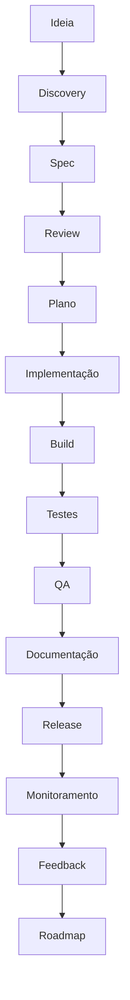

# Ciclo de Vida de Engenharia (Engineering Platform)

- **Status:** Stable
- **Version:** 1.0.0
- **Última Atualização:** 01/07/2026

## 1. Objetivo
Transformar o processo criativo em um fluxo de engenharia repetível, previsível e orientado a especificações. Garantir que nenhuma linha de código seja escrita sem planejamento prévio e documentação adequada. O código não é a documentação; a documentação comanda o código.

## 2. Contexto
Historicamente, o desenvolvimento orgânico de funcionalidades resulta em "conhecimento tribal" e dívida técnica. Este documento define a espinha dorsal de como novas ideias (Features) transitam desde a concepção até a monitoria em produção, estabelecendo um ambiente propício para contribuição de humanos e Inteligências Artificiais.

## 3. Responsabilidades
- **Product Owner / Stakeholder:** Preencher a fase de Ideia e Discovery.
- **Engenheiro / IA Agent:** Conduzir da Especificação (Spec) até o Release, passando rigorosamente pelos Checklists.
- **Plataforma (CI/CD):** Garantir Testes, Build e métricas de Telemetria pós-lançamento.

## 4. Fluxo de Engenharia (Spec-Driven Engineering)

O desenvolvimento no projeto "Achadinhos em Minutos" obedece ao seguinte rito imutável:

### Detalhamento das Etapas

1. **Ideia:** O embrião. Um desejo de negócio ou necessidade técnica anotada informalmente.
2. **Discovery:** Avaliação de viabilidade. Pesquisa de APIs de terceiros, limitações técnicas e impacto arquitetural (Geração de ADRs, se aplicável).
3. **Spec:** Escrita formal do documento de especificação utilizando os [Templates de Spec](./specs/templates/). O código **ainda não começou**.
4. **Review:** Validação humana ou via IA para assegurar que a Spec cobre Edge Cases, Fallbacks, Segurança e Telemetria.
5. **Plano:** O plano de ação e checklist diário, gerando o `task.md`.
6. **Implementação:** Codificação estrita baseada na Spec, sem atalhos e aderente aos [Coding Standards](./architecture/coding-standards.md). **Novos pipelines ou motores complexos (ex: Creative OS) DEVEM ser encapsulados atrás de Feature Flags (ex: `creative_os`) para garantir fallback seguro e rollout incremental.**
7. **Build:** Compilação do TS via Vite e TSC para garantir tipagem limpa e lint zero.
8. **Testes:** Execução das suítes de teste (Unitário, E2E). *(Planned)*
9. **QA:** Validação humana ou heurística (Checklist de Quality).
10. **Documentação:** Atualização obrigatória dos `Playbooks`, `Standards`, ou `ADRs` com as decisões consolidadas na implementação.
11. **Release:** Merge na `main` e implantação no ambiente de produção.
12. **Monitoramento:** Acompanhamento via Telemetria, verificando `System Logs` e `Audit Logs` para regressões.
13. **Feedback:** Retorno quantitativo (métricas) e qualitativo do usuário final.
14. **Roadmap:** A feature madura sai do backlog contínuo para o Roadmap oficial, originando um novo ciclo.

## 5. Ligações e Referências (Cross-Links)
- 🤖 [**AI Rulebook**](./AI_RULEBOOK.md): Regras de comportamento para agentes IA atuando neste fluxo.
- 📐 [**Quality Checklists**](./quality/): Checklists utilizados nas fases de QA e Release. *(Planned)*
- 🧩 [**Spec Templates**](./specs/templates/): Modelos obrigatórios para a fase de Spec. *(Planned)*

## 6. Histórico de Versão
- **v1.0.0 (01/07/2026):** Criação inicial e formalização do Spec-Driven Engineering.
