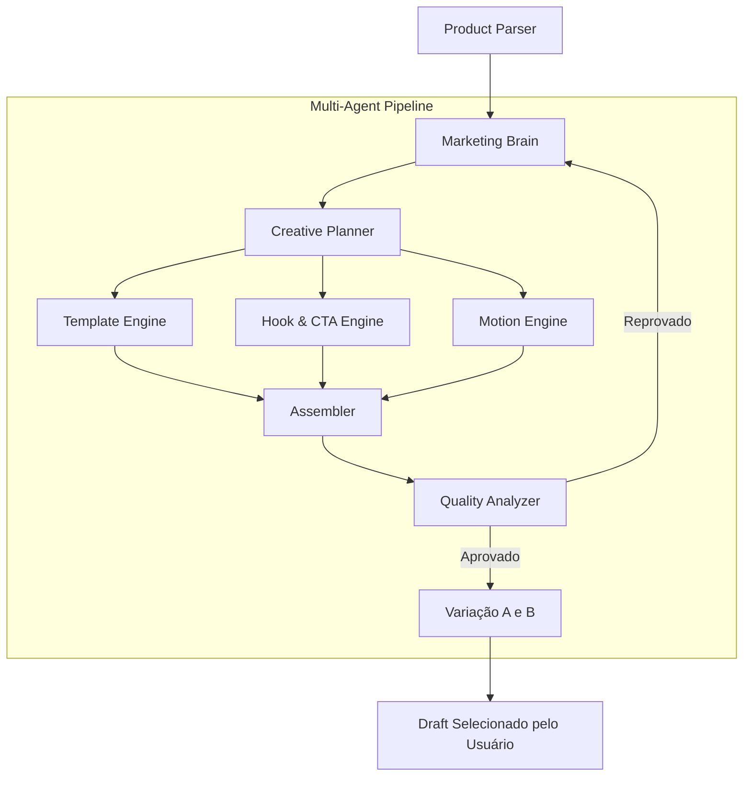

# Arquitetura de Inteligência Artificial Generativa

> [!IMPORTANT]
> O módulo "Creative Studio" não é apenas um simples disparador de Prompts genéricos. Ele opera sob um **Pipeline Multi-Agente** desenhado para garantir qualidade (Marketing Brain), engajamento (Hook Engine) e correção (Quality Analyzer).

## 1. O Fluxo de Extração e Enriquecimento

Antes de invocar o LLM (Large Language Model), o sistema garante que possua insumos suficientes para ancorar a IA na realidade (Grounding).

1. **`ProductLinkParserService`**: Tenta extrair a foto real, Título e Preço da página oficial (Shopee, ML).
2. Se o anti-bot da página bloquear o request HTTP/Scraping, ele aciona o Fallback de mock e marca `original_image_found: false`. (O usuário pode consertar subindo a imagem manual no Frontend, conforme documentado).

## 2. Pipeline de Processamento Criativo (V2 Atual) e V3 (Creative OS)

A V2 da nossa arquitetura divide o cérebro em agentes especialistas (Engines).
> **Nota de Evolução (V3):** Estamos implementando o *Creative OS* (atrás da feature flag `creative_os`). Na V3, o pipeline ganha novos motores (Layout, Color, Typography, etc) e é validado pelo `CreativeReviewer` com `Dual Score`. O fluxo V2 atua como fallback.



### 2.1 Marketing Brain
- O orquestrador central. Define a persona, tom de voz, e ângulos de vendas baseado no nicho do produto (ex: "Tecnologia", "Casa").

### 2.2 Engines Paralelas
- **Template Engine**: Cuida da estruturação do roteiro do vídeo.
- **Hook & CTA Engine**: Focado estritamente nos 3 primeiros segundos (Gancho) e na indução de clique (Chamada para Ação).
- **Motion Engine**: Define transições, tempo de cada cena (duração) e elementos visuais de apoio (stickers, overlays) para a renderização do vídeo.

### 2.3 Quality Analyzer
- Um passe final (Self-Correction). A IA avalia se a resposta final estourou o tempo de leitura do TikTok/Reels, se parece um "vendedor robótico", e aplica punição. O sistema tenta refazer o roteiro até no máximo 3 vezes (Max Retries) se reprovado.

## 3. Componente de Avaliação Contínua
- **Learning Engine (Em Construção)**: Pipeline futuro que receberá dados analíticos (Cliques, Views, Compras) e mutará os templates do "Marketing Brain", alimentando o banco de dados vetorial de exemplos bem-sucedidos.

## 4. O Output (Metadados do Criativo)
O resultado do pipeline não é um texto puro, e sim uma estrutura JSON estrita salva na coluna `metadata` da tabela `creatives`.

Exemplo de abstração armazenada:
```json
{
  "hook": "Você não vai acreditar no que essa ringlight faz...",
  "scenes": [
    {
      "type": "image_pan",
      "duration": 3.0,
      "text_overlay": "Perfeito para gravar TikToks",
      "voiceover_text": "Se você cria conteúdo..."
    }
  ],
  "cta": "Link nos comentários!"
}
```
Isso é o que permite o **Video Renderer (Worker)** e o **Storyboard Editor (Frontend)** traduzirem o roteiro em pixels.
