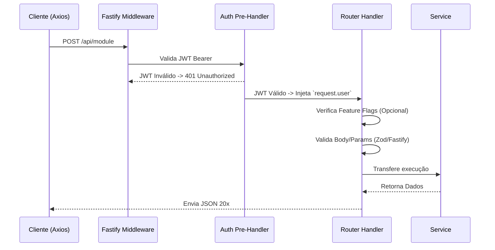

# Fastify Core API

> [!TIP]
> A API do sistema foi projetada no padrão REST. Toda resposta segue um formato consistente em JSON. O servidor roda nativamente sob o Fastify visando alta performance no processamento HTTP.

## 1. Fluxo de uma Requisição

Quando uma requisição chega na API (porta 3001), o seguinte ciclo de vida ocorre:

## 2. Principais Endpoints e Domínios

### 2.1 `/api/creatives` (Creative Studio)
O módulo de IA para conversão de URLs em mídia.
- `GET /` -> Lista criativos do usuário.
- `POST /generate-from-link` -> Ingere uma URL e inicia IA (Brain + Planner) para copy e metadados.
- `POST /:id/render` -> Empurra o criativo aprovado no Storyboard para a fila de renderização (Video Worker).
- `POST /:id/upload-image` -> Recebe arquivo de imagem local e sobe pro Storage, ativando Fallback em caso de bloqueio.

### 2.2 `/api/campaigns` (Distribuição)
Organização do disparo agendado.
- `GET /` -> Lista campanhas.
- `POST /` -> Cria campanha (especificando plataforma, ex: Telegram).
- `GET /:id/logs` -> Puxa a tabela `send_logs` associada a posts da campanha.

### 2.3 `/api/scheduled-posts` (Agendamentos)
Itens inseridos numa campanha.
- `POST /` -> Cria posts passando um `creative_id` e um tempo `scheduled_at`.
- `DELETE /:id` -> Cancela um envio futuro.

### 2.4 `/api/health` e Monitoramento
Rotas cegas para checagem de infraestrutura.
- `GET /health` (ou `/api/health`) -> Verifica conectividade do Redis, Banco de Dados, Fila BullMQ e API nativa. Retorna `status: ok` ou `status: degraded`. Utilizada para Kubernetes / Docker Swarm probes.

## 3. Segurança e Middlewares

- **`requireAuth`**: A maior parte da aplicação roda atrás desta função injetada via `preHandler`. Ele verifica o JWT utilizando a chave secreta do Supabase, confirmando se o JWT foi forjado ou se está expirado. O `uid` extraído é repassado ao `request.user.id`.
- **RBAC Simplificado:** A validação de `Role` (admin, curador, usuário base) e de `Feature Flags` acontece localmente dentro dos Controllers (Rotas) ou Services.

## 4. Padronização de Respostas de Erro

Para que o Front-End entenda claramente o que ocorreu:
- **400 Bad Request**: Falha de Validação Zod, arquivo de imagem imenso ou formato incompatível.
- **401 Unauthorized**: Falta de token ou token inválido.
- **403 Forbidden**: Feature não habilitada no plano (`FeatureFlagService.isEnabled() === false`) ou permissão insuficiente (querer editar um criativo que não é dono).
- **404 Not Found**: ID solicitado não localizado sob a posse daquele user_id.
- **500 Internal Server Error**: Exceção não controlada, API Provider (OpenAI/Anthropic) fora do ar, quebra no BD.
