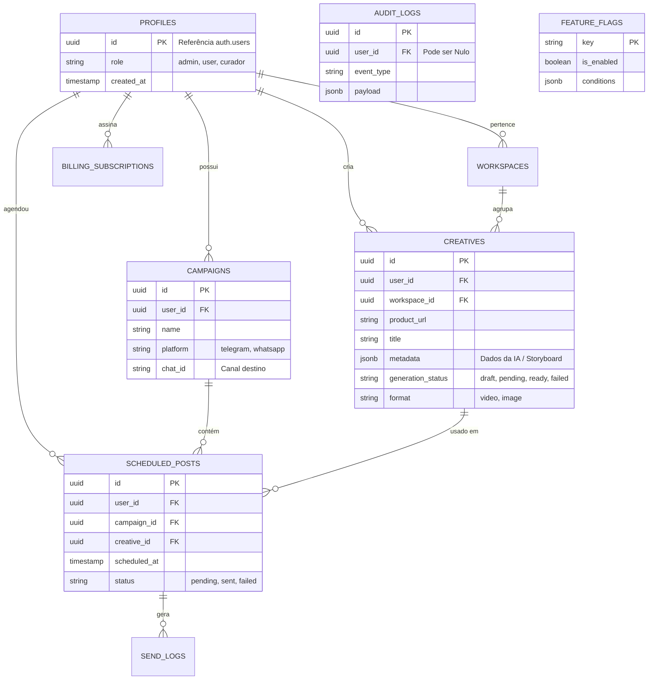

# Arquitetura de Dados e Banco de Dados (Database)

> [!NOTE]
> Todo o banco de dados é gerenciado pelo **Supabase (PostgreSQL)**. Utilizamos `Row Level Security (RLS)` de forma nativa e estrita, o que significa que as policies de acesso são declaradas no banco e não no código.

## 1. Diagrama de Entidade e Relacionamento (ERD)

Abaixo está o diagrama das principais tabelas do domínio e como elas se correlacionam. (Algumas colunas secundárias foram suprimidas para clareza visual).

## 2. Dicionário de Tabelas Core

### `profiles` (Users)
- **Objetivo:** Armazena dados públicos e metadados dos usuários (já que senha e email ficam confinados no schema `auth` do Supabase).
- **RLS:** Usuários só podem dar `SELECT` e `UPDATE` no próprio registro `id = auth.uid()`.

### `creatives`
- **Objetivo:** O coração do Creative Studio. Armazena os URLs de origem, as imagens extraídas, o roteiro (copy) gerado pela IA e o status de renderização do vídeo.
- **Campos Especiais:** `metadata` (JSONB) que armazena todo o payload de IA (Template Engine, Marketing Brain), para não inflar a tabela de colunas genéricas.

### `campaigns` & `scheduled_posts`
- **Objetivo:** Estruturar a distribuição do conteúdo gerado para redes sociais ou Telegram.
- **Fluxo:** O `Campaign Runner Worker` varre `scheduled_posts` onde `status = pending` e `scheduled_at <= NOW()`, agrupando pela `campaign_id`.

### `audit_logs` & `telemetry_logs`
- **Objetivo:** Logs imutáveis. O Audit rastreia atividades do usuário, a Telemetria rastreia performance do sistema.
- **Constraints:** Ocasionalmente, inserção massiva requer uma tabela otimizada sem Foreign Keys estritas ou Triggers pesadas.

## 3. Segurança RLS (Row Level Security)

Todas as tabelas possuem as seguintes premissas de RLS ativas:
1. `ENABLE ROW LEVEL SECURITY;`
2. **Policy de Leitura:** `CREATE POLICY "Leitura" ON tabela FOR SELECT USING (auth.uid() = user_id);`
3. **Policy de Inserção:** `CREATE POLICY "Insercao" ON tabela FOR INSERT WITH CHECK (auth.uid() = user_id);`

**Exceções:**
- Trabalhadores (Workers) utilizando `supabaseAdmin` (chave Service Role) ignoram as regras RLS. Essa é a única forma de um Worker de background que não possui JWT alterar o status de um registro.

## 4. Migrations

Para alterar o banco, **NUNCA** mude tabelas via interface gráfica em Produção.
Siga o fluxo local:
1. Crie uma nova migration: `supabase migration new NOME`.
2. Escreva o SQL com `CREATE TABLE` ou `ALTER TABLE`.
3. Aplique localmente: `supabase db reset`.
4. Garanta que incluíram as policies RLS na própria migration.
