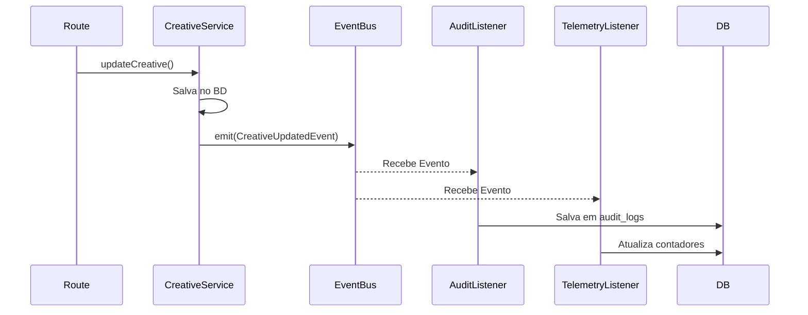

# Event-Driven Architecture (EDA)

> [!TIP]
> A plataforma usa um Event Bus em memória (`mitt` tipado no Node) para implementar um CQRS-Lite. O objetivo é desacoplar ações secundárias (como Telemetria e Auditoria) do fluxo principal e síncrono da aplicação.

## 1. O Padrão Observer via EventBus

A classe `EventBus` exportada em `apps/api/src/events/index.ts` permite que os Services apenas declarem "O que aconteceu" em vez de mandarem outros serviços agirem.

## 2. Tipos de Eventos de Domínio

O sistema define os seguintes eventos em `event-types.ts`:

### Creative Studio
- `CreativeGenerationStartedEvent`
- `CreativeGeneratedEvent`
- `CreativeGenerationFailedEvent`
- `CreativeSavedEvent`
- `CreativeUpdatedEvent`
- `CreativeDeletedEvent`
- `CreativeImageUploadStarted`
- `CreativeImageUploaded`
- `CreativeFallbackAccepted`

### Campanhas e Envios
- `CampaignCreatedEvent`
- `MessageSentEvent`
- `MessageFailedEvent`

## 3. Listeners e Reatividade

O arquivo `listeners.ts` intercepta estes eventos em tempo de inicialização do servidor e roteia para os lugares corretos:
- **Audit Logs:** Uma classe específica formata o payload (quem clicou, qual foi o input original, o IP) e insere na tabela imutável de `audit_logs` que o usuário final consegue ver em sua Dashboard.
- **System Logs / Telemetria:** Atualiza Dashboards de uso (Quantos MBs renderizados? Quantas chamadas a API OpenAI falharam? Qual o tempo médio de geração?).

## 4. Retries nos Listeners

Atualmente o EventBus em memória é "fire-and-forget" para extrema performance, significando que falhas num listener de Telemetria (ex: timeout do banco de logs) não travam a resposta ao usuário.

Se for crítico garantir a execução em caso de crash do Node.js logo após a emissão, o padrão dita enviar não para o EventBus, mas para a Fila do Redis (Worker). Portanto, eventos no EventBus são considerados _Side Effects não cruciais para a consistência forte_ do banco.
