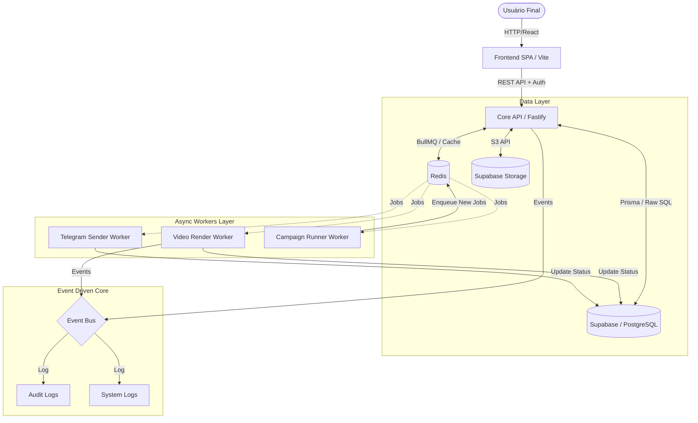
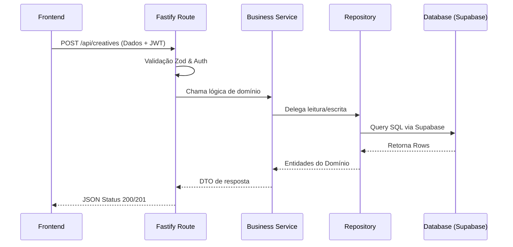

# Arquitetura Geral (Overview)

> [!NOTE]
> Este documento apresenta a visão macroscópica de como os componentes da plataforma "Achadinhos em Minutos" interagem, desde a entrada de dados no Frontend até a persistência e processamento em background.

## 1. Topologia do Sistema

A arquitetura segue o modelo de **Client-Server com Processamento Assíncrono Desacoplado**, desenhado para alta disponibilidade mesmo durante cargas intensas (ex: geração de IA e renderização de vídeo).

O tráfego flui da seguinte maneira:

## 2. Padrões Arquiteturais Fundamentais

### Backend-For-Frontend (BFF)
Nossa Fastify API age primariamente para servir o Frontend web, consolidando os microsserviços internos, abstraindo lógicas de terceiros (Shopee, Mercado Livre, OpenAI, Anthropic) e aplicando políticas rigorosas de segurança antes de tocar no banco.

### Separation of Concerns (Camadas Estritas)
O backend da aplicação é segmentado em camadas bem definidas, garantindo facilidade de teste e isolamento de estado:

### Processamento Orientado a Eventos e Filas
O sistema NUNCA faz operações bloqueantes demoradas (ex: chamadas lentas de IA que excedam alguns segundos ou renderização de vídeos de megabytes) na thread principal HTTP. Tais ações são injetadas no **Redis (via BullMQ)** e consumidas por um ecosistema de **Workers**.

Quando um Worker termina seu serviço, ele emite um evento local no `EventBus` e/ou atualiza diretamente as linhas de status no banco de dados, que o Frontend lê por _polling_ ou _WebSockets_ no futuro.

## 3. Segurança (Defense-in-Depth)

A arquitetura emprega camadas concêntricas de proteção:

1. **Camada Edge:** Proteção do Provedor de Cloud contra DDoS/Bots.
2. **Camada Auth:** Todos os requests dependem de JWT assinado pelo Auth do Supabase. A API valida _Role_ e _Claims_.
3. **Camada Route:** Validações de payload estritas com `Zod`. Nenhum lixo entra no sistema.
4. **Camada Database (RLS):** O banco confia em regras de `Row Level Security (RLS)`. Nenhum Tenant (Usuário A) enxerga linhas do Tenant B, mesmo se o Backend tiver uma falha lógica de filtragem.

## 4. O Fluxo Completo de Vida de um Produto

Para ilustrar o design, este é o fluxo macro de quando o usuário cadastra um link:

1. **Ingestão:** Frontend chama `/api/creatives/generate-from-link`.
2. **Parser:** O Service busca extrair dados da página via HTTP request direto ou bibliotecas de raspagem.
3. **IA Generativa:** Se aprovado, o texto entra no pipeline de Inteligência Artificial para roteiro.
4. **Persistência Inicial:** O `Creative` é salvo no PostgreSQL (Supabase) com `status = draft`.
5. **Decisão:** Usuário aprova rascunho na tela. Ele invoca `/api/creatives/:id/render`.
6. **Enfileiramento:** Status vai para `pending`. A API despacha para Redis Fila de Render.
7. **Trabalho Pesado:** Worker de Video coleta job do Redis, baixa assets, aplica FFmpeg / Canvas render.
8. **Upload:** Worker faz upload do resultado no Supabase Storage.
9. **Finalização:** Worker atualiza tabela de Creatives (`status = ready`), emite o log final no EventBus, encerrando o ciclo.
