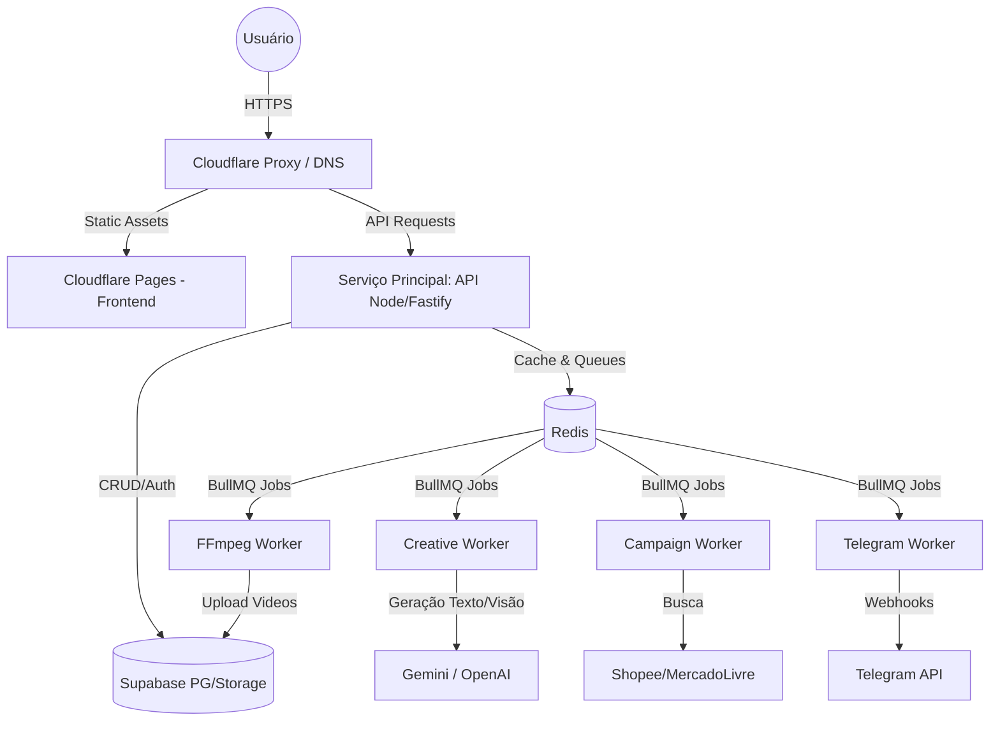

# Arquitetura de Produção

A arquitetura do sistema **Achadinhos em Minutos** foi projetada visando alta disponibilidade, escalabilidade e separação de responsabilidades (Isolamento de Processos).

## Diagrama Geral

## Separação de Responsabilidades

### 1. API (Serviço Web)
- **Tecnologia:** Fastify (Node.js).
- **Escopo:** Autenticação, Endpoints REST, Webhooks Asaas/Stripe, Interações com o Dashboard.
- **Regra de Ouro:** A API *nunca* processa vídeos pesados, mineração de longo prazo ou inteligência artificial síncrona se não for extremamente rápida.

### 2. Workers (BullMQ)
Por padrão rodamos 4 workers independentes para evitar contenção de recursos na API.
- **Creative Worker**: Cuida de geração de IA (Storyboard, Prompts) e estruturação do Creative OS.
- **FFmpeg Worker**: Processamento pesado de CPU e Disco para renderização, encoding e trim de vídeos.
- **Campaign Worker**: Processos de mineração em lojas online.
- **Telegram Worker**: Disparo de campanhas via bot.

### 3. Banco de Dados e Storage
- Usamos o **Supabase** via API (Postgres) para toda persistência transacional de usuários, integrações, log de pagamentos, etc.
- O Storage do Supabase é utilizado como repositório de assets de mídia originais e vídeos renderizados finais.

### 4. Cache e Mensageria
- **Redis**: Mantido para gerenciamento de Jobs (BullMQ), bloqueios distribuídos (Rate Limits) e cache de respostas repetitivas.
