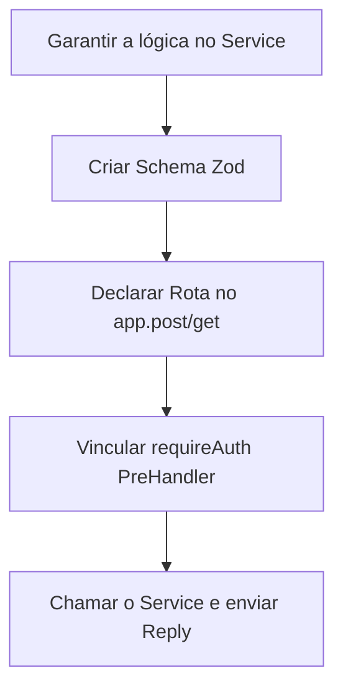

# Playbook: Criar Novo Endpoint (API Route)

- **Status:** Stable
- **Versão:** 1.0.0
- **Última Atualização:** 01/07/2026

## 1. Quando utilizar
Utilize este roteiro quando a base de dados já suporta a funcionalidade e não há novas interfaces, mas o frontend (ou um parceiro) exige um novo canal de leitura ou escrita via HTTP (`apps/api/src/routes/`).

## 2. Arquivos envolvidos
- `docs/specs/api/*.md` (Sempre inicie aqui).
- `apps/api/src/routes/[dominio].ts` (O Controller).
- `apps/api/src/services/[dominio].service.ts` (A Lógica).

## 3. Fluxo de Desenvolvimento

## 4. Boas práticas
- **Não suje o Controller:** A rota `.ts` deve ter menos de 50 linhas se possível. Tudo o que ela deve fazer é validar Zod, instanciar a chamada ao Service, pegar o resultado e dar `.send()`. Se tiver regra de negócio solta aqui, mova para o Service.
- **Evite Rotas no Vazio:** Verifique se o recurso se enquadra num agrupamento REST já existente (ex: se é envio de criativo, ponha em `routes/creatives.ts`, não crie `routes/envios.ts`).
- **Sanitize a saída:** Nunca retorne a entidade do Supabase crua com a senha de usuário, emails encriptados ou chaves sensíveis. Crie um objeto limpo antes de mandar para o front.

## 5. Testes Recomendados
- Iniciar o servidor local.
- Bater na rota diretamente via `cURL` ou `Postman/Insomnia`.
- Testar o envio de um JSON malformado para garantir que o Fastify + Zod retornam HTTP `400 Bad Request` com os campos amigáveis, e não um HTTP `500` bizarro.

## 6. Checklist de Implementação
- [ ] Schema Zod foi definido em Typescript e anexado ao Fastify Type Provider.
- [ ] O `requireAuth` foi adicionado se for rota restrita.
- [ ] A delegação para o `Service` é protegida por Try/Catch ou gerenciador de erro Fastify.
- [ ] Não há acessos literais `supabase.from()` no arquivo da Rota.
