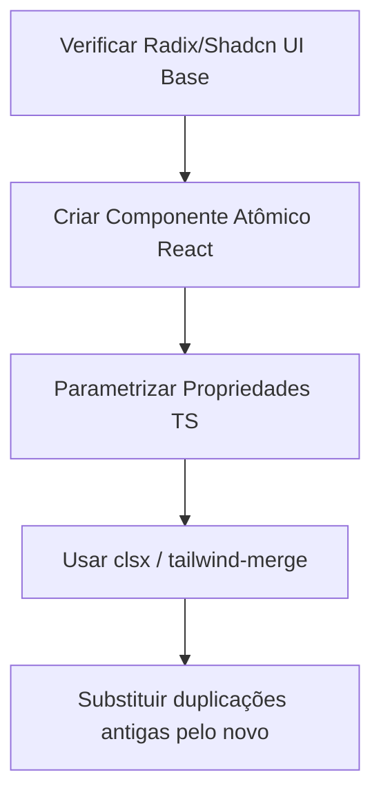

# Playbook: Criar Novo Componente do Design System

- **Status:** Stable
- **Versão:** 1.0.0
- **Última Atualização:** 01/07/2026

## 1. Quando utilizar
Utilize ao perceber que múltiplos arquivos `.tsx` estão com o mesmo bloco de HTML monstruoso duplicado (ex: O mesmo modal feio copiado e colado 4 vezes).

## 2. Arquivos envolvidos
- `apps/web/src/components/ui/[meu-componente].tsx`

## 3. Fluxo de Desenvolvimento

## 4. Boas práticas
- **Componibilidade em Primeiro Lugar:** Faça botões aceitarem `children` ao invés de um estrito `text="string"`. Isso permite botar ícones depois.
- **Tailwind Inteligente:** Nunca deixe classes string-concatenadas puras (`"btn " + props.className`). Use o utilitário `cn()` importado da base do Shadcn-ui para garantir que margens customizadas prevalecem sobre as bases do botão.
- **Sem Camada de Domínio:** O componente `ui/button.tsx` não sabe quem é o "Usuário", não sabe o que é "Supabase". Ele é burro e atômico.

## 5. Testes Recomendados
- Tente estourar as margens passando um texto de 300 palavras como `children`. Avalie se ele aplica o text-ellipsis ou se quebra para fora da Viewport.

## 6. Checklist de Implementação
- [ ] Sem estado global injetado diretamente nele.
- [ ] Tipos explicitados.
- [ ] Usa tailwind-merge (via cn) para estilos customizados no consumo.
