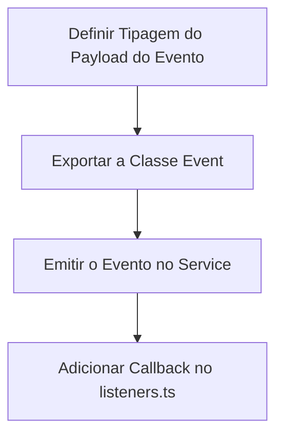

# Playbook: Criar Novo Evento de Sistema

- **Status:** Stable
- **Versão:** 1.0.0
- **Última Atualização:** 01/07/2026

## 1. Quando utilizar
Ao final de operações significativas de mutação de domínio (criação de um vídeo, cancelamento de plano, geração da IA finalizada) quando não quiser acoplar o Service com a Telemetria ou com as dezenas de outros serviços.

## 2. Arquivos envolvidos
- `apps/api/src/events/event-types.ts`
- `apps/api/src/events/listeners.ts`

## 3. Fluxo de Desenvolvimento

## 4. Boas práticas
- **Não bloqueie requisições HTTP:** O `EventBus` deve atuar apenas de despachante leve. Os Listeners preferencialmente não devem fazer Throw Error se falharem em salvar no log. Um erro de Telemetria nunca deveria dar erro 500 para o usuário final. (Encapsule num try-catch silencioso com console error puro).
- **Correlation Id:** Garanta que cada evento leve sempre o ID do usuário (Actor) e um RequestId único caso precise juntar os logs depois.

## 5. Testes Recomendados
- N/A. Teste a emissão rodando a funcionalidade correspondente localmente e observando a janela de logs do AuditLog.

## 6. Checklist de Implementação
- [ ] Classe Event está documentada.
- [ ] A interface injetada não transfere senhas puras em payload.
