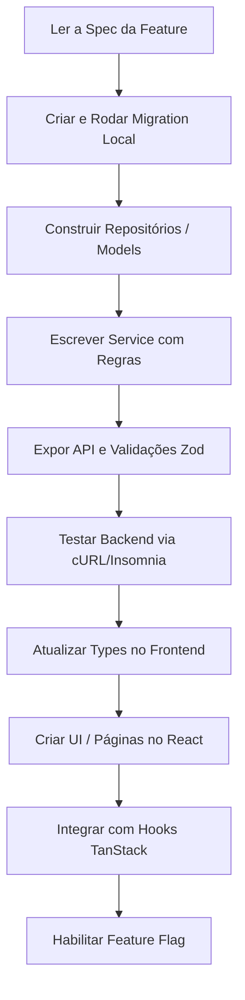

# Playbook: Criar Nova Feature (End-to-End)

- **Status:** Stable
- **Versão:** 1.0.0
- **Última Atualização:** 01/07/2026

## 1. Quando utilizar
Utilize este roteiro quando for orquestrar uma funcionalidade macro que afete múltiplas camadas do sistema (Banco de Dados, API, e Interface Gráfica simultaneamente). Se a alteração for restrita a uma única camada, utilize os playbooks específicos (ex: `new-api.md`).

## 2. Arquivos envolvidos
Uma feature global geralmente espalha-se pela taxonomia inteira:
- `docs/specs/features/*.md` (Sempre inicie aqui).
- `supabase/migrations/*` (Se houver novas tabelas).
- `apps/api/src/routes/` e `apps/api/src/services/`
- `apps/web/src/pages/` e `apps/web/src/components/`

## 3. Fluxo de Desenvolvimento

O fluxo obedece ao Spec-Driven Engineering. Nunca comece escrevendo a rota ou o botão no frontend de forma isolada.

## 4. Boas práticas
- **Trabalho Vertical (Slices):** Não tente fazer "Todo o Backend" e depois "Todo o Frontend" se a feature for gigante. Construa "Cenário 1 completo (Back+Front)", depois "Cenário 2 completo".
- **Esconda o trabalho incompleto:** Envolva o ponto de entrada da feature (ex: O botão no menu lateral) numa **Feature Flag** (`if (ff_nova_feature) return null;`), permitindo fazer o merge na `main` sem que os usuários vejam um componente pela metade.
- **Evite Dívida Técnica:** Não pule a escrita da Spec "porque é uma feature pequena". Use o template.

## 5. Testes Recomendados
- Crie um arquivo de teste unitário ao lado da lógica de negócios pesada (`.test.ts`).
- Na falta de E2E automático *(Planned)*, realize sempre o Smoke Test manual cruzando o fluxo feliz (Happy Path) na interface gráfica com o console e Network tab abertos para detectar gargalos.

## 6. Checklist de Implementação
- [ ] Spec aprovada (`docs/specs/`).
- [ ] Tipos gerados (`supabase db types` caso exista migration).
- [ ] RLS criadas para as novas tabelas.
- [ ] Rotas blindadas via Zod.
- [ ] Integração com botão envolta por Feature Flag.
- [ ] Telemetria de sucesso adicionada.
