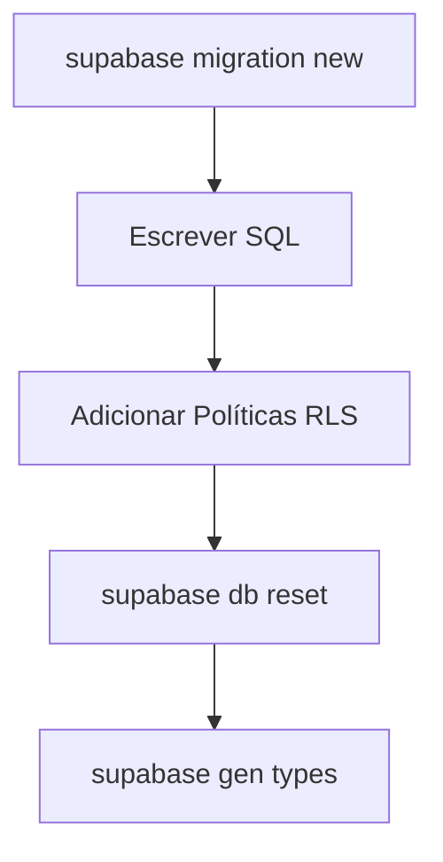

# Playbook: Criar Nova Migration de Banco de Dados

- **Status:** Stable
- **Versão:** 1.0.0
- **Última Atualização:** 01/07/2026

## 1. Quando utilizar
Utilize rigorosamente ao alterar qualquer característica do banco de dados (Novas tabelas, deleção de colunas, triggers, RPCs, views ou novos RLS). **Nunca** faça alterações visuais no Dashboard do Supabase Cloud.

## 2. Arquivos envolvidos
- `supabase/migrations/[TIMESTAMP]_[NOME].sql`

## 3. Fluxo de Desenvolvimento

## 4. Boas práticas
- **RLS Rigoroso:** Ao criar tabelas de sistema multi-inquilino (user_id), é compulsório atrelar `ALTER TABLE minha_tabela ENABLE ROW LEVEL SECURITY;`.
- **Zero-Downtime:** Para deleção de colunas importantes ou tabelas, faça em duas migrations separadas por semanas. Uma migration parando de usá-la no código (Deployment 1) e uma dropando ela no banco (Deployment 2). Isso evita crash durante o gap da Vercel.
- **Tipos TypeScript Fortes:** Sempre rode o gerador de tipos para sincronizar a interface frontend/backend com a tabela após aplicá-la em dev.

## 5. Testes Recomendados
- Iniciar os serviços locais do Supabase (`supabase start`) e testar se a interface RLS realmente funciona inserindo com a Chave Anônima.

## 6. Checklist de Implementação
- [ ] Migration criada e aplicada localmente com sucesso.
- [ ] RLS Policies inclusas no arquivo.
- [ ] Types gerados no repositório.
