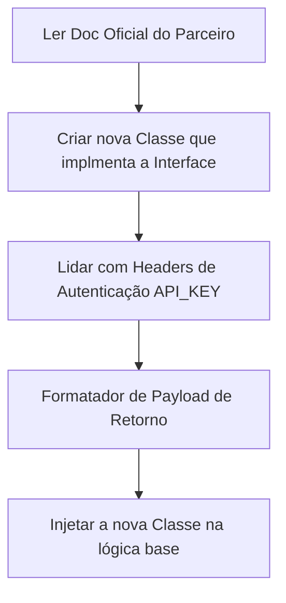

# Playbook: Conectar Novo Provider Externo

- **Status:** Stable
- **Versão:** 1.0.0
- **Última Atualização:** 01/07/2026

## 1. Quando utilizar
Utilize sempre que o sistema precisar conversar com uma nova LLM, uma nova ferramenta de scraping, nova voz clonada, etc. (Ex: Trocar de OpenAI para Anthropic).

## 2. Arquivos envolvidos
- `apps/api/src/lib/providers/`
- Arquivo `interface.ts` do padrão de Strategy.

## 3. Fluxo de Desenvolvimento

## 4. Boas práticas
- **Design Pattern (Strategy):** O nosso sistema não pode ter classes enraizadas estilo `const gpt = new OpenAI()`. Deve existir uma interface polimórfica `LLMProvider` que possua `.generateText(prompt)`. Se precisarmos mudar, apenas instanciamos `new AnthropicProvider()`.
- **Tratamento de Rate Limit:** Todo Provider terceiro pode te dar timeout. Sempre encapsule as chamadas em retries puros, mas não fique estagnado mais que 20 segundos bloqueando.
- **Blindagem de Keys:** Chaves de API nunca devem figurar no código-fonte (.ts). Apenas recupere de `process.env.PROVIDER_API_KEY`.

## 5. Testes Recomendados
- Desligar o WIFI local, bater a API e conferir se ele dá erro limpo ou se o container capota miseravelmente.

## 6. Checklist de Implementação
- [ ] Variável de ambiente cadastrada no painel Vercel / Cloud.
- [ ] Classe criada implementando a tipagem oficial estrita.
- [ ] Não há `console.log(API_KEY)` vazado para a telemetria sob nenhuma hipótese.
