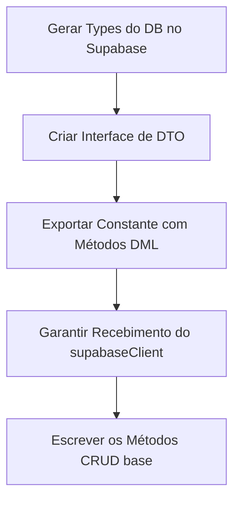

# Playbook: Criar Novo Repositório (Data Access)

- **Status:** Stable
- **Versão:** 1.0.0
- **Última Atualização:** 01/07/2026

## 1. Quando utilizar
Quando uma nova entidade for criada no banco de dados, você **nunca** deve invocar `.from('minha_tabela')` livremente pelas rotas Fastify. Você deve utilizar (ou criar) um Repository.

## 2. Arquivos envolvidos
- `apps/api/src/repositories/[entidade].repository.ts`

## 3. Fluxo de Desenvolvimento

## 4. Boas práticas
- **Pass-through Client:** O Repositório por si só **NÃO** deve inicializar o cliente logado, senão ele vai usar a mesma key para tudo. Toda função do repositório deve obrigatoriamente receber a instância autenticada local (ex: `client: SupabaseClient`) vinda do contexto que acionou (a rota logada do usuário ou o worker de root).
- **Tratamento Fino de Erro:** Supabase sempre retorna o objeto `{ data, error }`. O Repositório deve capturar `if (error)` e fazer o throw dele, impedindo a Rota de ter que ficar vasculhando `res.error` magicamente.
- **Nomenclatura Limpa:** Esconda a loucura do SQL. Um Service quer apenas chamar `CreativeRepository.getById(client, id)`.

## 5. Testes Recomendados
- Inserir um registro com mock client.
- Tentar recuperar um registro sem ser dono e garantir que o RLS devolva array vazio sem quebrar o Node.js.

## 6. Checklist de Implementação
- [ ] Funções assíncronas (async/await).
- [ ] Checagem explícita `if (error) throw error`.
- [ ] O Repositório exporta apenas a camada de DML (Data Manipulation Language).
