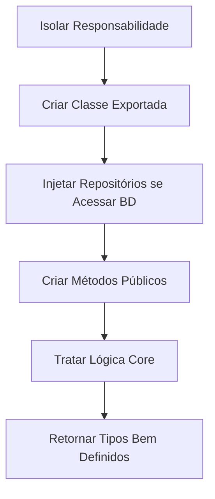

# Playbook: Criar Novo Service

- **Status:** Stable
- **Versão:** 1.0.0
- **Última Atualização:** 01/07/2026

## 1. Quando utilizar
Utilize quando o código que você está escrevendo envolver regras de negócios como faturamento, decisões da inteligência artificial, formatações ricas de DTOs antes de entregar ao Frontend ou quando múltiplas rotas diferentes da API precisam utilizar a exata mesma lógica pesada.

## 2. Arquivos envolvidos
- `apps/api/src/services/[nome].service.ts`

## 3. Fluxo de Desenvolvimento

## 4. Boas práticas
- **Single Responsibility (SRP):** Um `BillingService` não deveria enviar email de marketing nem acionar geradores de vídeo. Segregue se ficar gigante.
- **Evitar State:** Services preferencialmente são `stateless` (Não guardam variáveis de instância entre requisições que podem ser vazadas para outros usuários). O estado deve residir no Banco.
- **Tipagem Forte:** O método do Service *não deve retornar `any`*. O Typescript é seu aliado.

## 5. Testes Recomendados
- **Testes Puros:** Uma classe Service é a coisa mais fácil de testar no mundo. Crie um `[nome].service.test.ts`, chame as funções do service passando mock data de objetos JSON e inspecione se a lógica condicional ocorreu perfeitamente sem precisar subir o Fastify.

## 6. Checklist de Implementação
- [ ] Classe focada num domínio específico.
- [ ] Erros customizados se a regra for infligida (ex: Throw `AppError('Not_Enough_Credits')`).
- [ ] Tipos explicitados de input/output nos métodos.
