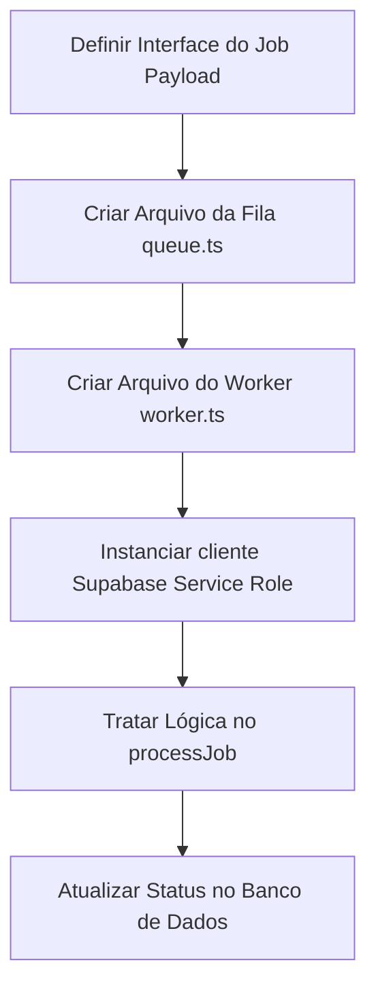

# Playbook: Criar Novo Worker (Fila/Background)

- **Status:** Stable
- **Versão:** 1.0.0
- **Última Atualização:** 01/07/2026

## 1. Quando utilizar
Sempre que o sistema precisar executar tarefas demoradas (> 2 segundos), tarefas intensivas de CPU (FFmpeg, Canvas) ou tarefas passíveis de limitação de rede/rate limit severo (Mandar mensagens pelo Telegram, requisições lentas de IA).

## 2. Arquivos envolvidos
- `apps/api/src/workers/[nome].worker.ts` (Onde vive o loop do worker).
- `apps/api/src/queues/[nome].queue.ts` (Onde o produtor é exposto para a API injetar jobs).
- Arquivo central de setup do Worker / `index.ts`.

## 3. Fluxo de Desenvolvimento

## 4. Boas práticas
- **Não importe contextos HTTP:** O Worker não sabe o que é Fastify, Request ou Response. Ele roda num buraco negro assíncrono.
- **Sandboxing Total:** O código dentro da callback principal do worker não deve compartilhar estado variável global para não vazar memórias em alta concorrência.
- **Use o Supabase Admin Key:** Workers não rodam sob o JWT de um usuário, logo RLS vai bloquear a edição se usar a anon key. Importe o cliente `supabaseAdmin` do módulo de libs para forçar alterações.
- **Idempotência Obrigatória:** Como BullMQ garante "pelo menos uma entrega", seu Worker pode ser chamado 2x para o mesmo Job se houver instabilidades no Redis. Garanta que rodar o mesmo Job não duplique pagamentos, não duplique campanhas ou estoure lógica. (Sempre confirme no BD o status antes de começar).

## 5. Testes Recomendados
- Forçar uma falha bruta jogando um `throw new Error()` no meio da lógica e atestar se o BullMQ marca como Failed e tenta o Retry (Exponential Backoff).
- Verifique se a memória não sobe infinitamente observando o terminal Node/Docker ao rodar 100 jobs genéricos.

## 6. Checklist de Implementação
- [ ] O Nome da fila e prefixos Redis coincidem (BullMQ Connection).
- [ ] A interface (Type) do dado transitado no `.add()` é a mesma esperada no Job do Worker.
- [ ] Tentativas (Retries) estão fixadas na configuração do Producer (no `queue.ts`).
- [ ] Status gravados no Supabase no Início, Sucesso e Erro (catch).
