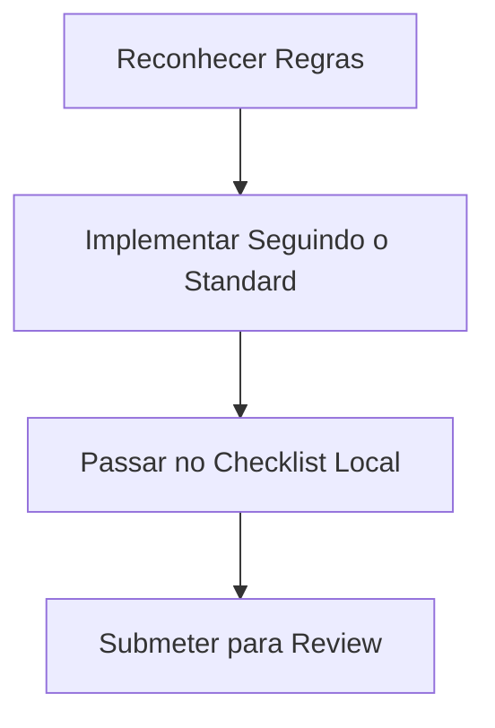

# Standard: Documentation Checklist

## 1. Metadados
- **Status:** Stable
- **Versão:** 1.0.0
- **Autor:** Plataforma de Engenharia
- **Última Atualização:** 01/07/2026

## 2. Objetivo
Auditoria da fonte oficial da verdade.

## 3. Escopo
Aplica-se globalmente ao desenvolvimento de features e manutenções do projeto Achadinhos em Minutos. Nenhuma release deverá ignorar este artefato.

## 4. Responsabilidades
- **Desenvolvedor / IA:** Consultar, aplicar e evoluir as melhores práticas.
- **Reviewer:** Negar PRs que não satisfaçam os preceitos.
- **Tech Lead:** Auditar as exceções documentadas nos ADRs.

## 5. Fluxo de Execução

## 6. Exemplos Práticos
- Utilize o padrão de `Repository Pattern` explicitamente isolado (Conforme o `ADR-001`).
- Exponha `Feature Flags` nas implementações visuais (`ADR-006`).

## 7. Boas Práticas
- **Mantenha Simples:** Código não é lugar de filosofar, é lugar de resolver problemas de negócios.
- **Respeite o Design:** `Shadcn UI` e Tailwind são as fontes de verdade de estilo.
- **Isolamento de Falhas:** IAs terceiras caem sempre, aplique Timeout/Retry.

## 8. Anti-Padrões (Más Práticas)
- *Hardcoding* de senhas.
- Rotas `Fastify` enormes.
- `SELECT * FROM` desnecessário na UI.

## 9. Métricas Associadas
- *Lead Time*: Tempo da Ideia até Release deve cair ao usar esse padrão.
- *MTTR (Mean Time to Recovery)*: Aplicação do Checklist de Rollback reduz impactos críticos.

## 10. Checklist Final
- [ ] Lido e compreendido.
- [ ] Aplicado no Pull Request atual.
- [ ] Validado pelos pares ou ferramentas estáticas de Lint.

## 11. Integrações (Referências Cruzadas)
Este documento pertence à engrenagem descrita em:
- [SYSTEM.md](../../SYSTEM.md)
- [ENGINEERING.md](../../ENGINEERING.md)
- [AI_RULEBOOK.md](../../AI_RULEBOOK.md)
- Consulte também os [Playbooks Oficiais](../../playbooks/) e [ADRs](../../adr/) correlacionados.
