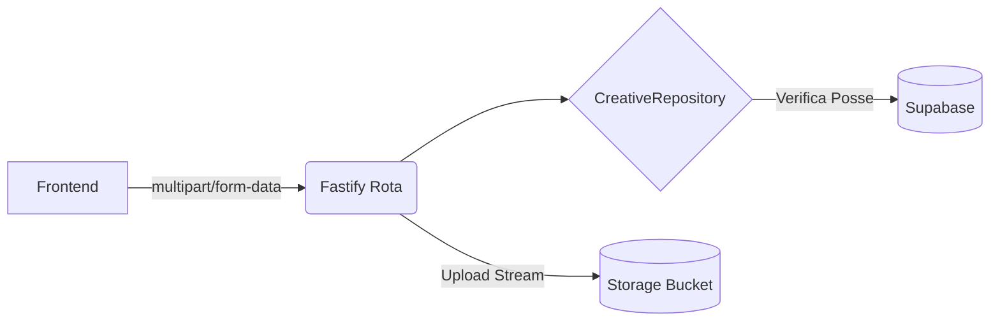

# Spec: [Nome da API ou Rota]

> [!NOTE]
> **Como usar este Template:** Utilize o `api-template.md` para especificar a criação de uma nova rota no Fastify, definindo rigorosamente seu Payload e Retornos.
> **Exemplo Preenchido:** `POST /api/creatives/upload`

## 1. Metadados
| Propriedade | Detalhe |
|---|---|
| **Título** | Endpoint de Upload Local de Creatives |
| **Autor** | [Seu Nome] |
| **Data de Criação** | DD/MM/AAAA |
| **Status** | `Approved` |
| **Versão** | 1.1.0 |
| **Responsável** | Backend Squad |
| **Última Atualização** | DD/MM/AAAA |

## 2. Objetivo
Permitir que o front-end submeta uma imagem crua ignorando o fallback da IA e grave-a na respectiva linha do BD de um `Creative`.

## 3. Contexto
As integrações web-scraping frequentemente falham. O usuário precisa de uma forma manual de forçar o andamento da IA fornecendo sua própria imagem.

## 4. Requisitos Funcionais
- **RF01:** O endpoint deve aceitar `multipart/form-data`.
- **RF02:** Deve validar tamanho máximo de 5MB.
- **RF03:** Retornar a public URL da imagem hospedada.

## 5. Requisitos Não Funcionais
- **Performance:** Stream direto via buffer para o Supabase Storage, sem salvar no disco do servidor Fastify.
- **Segurança:** Apenas o dono do Creative pode fazer o upload para o respectivo ID.
- **Resiliência:** N/A. O erro é devolvido sincronicamente em caso de timeout no Supabase.

## 6. Arquitetura

## 7. Banco de Dados
- **Novas tabelas:** Nenhuma.
- **Migrações:** N/A.
- **Índices:** Uso do índice existente no `id` de Creatives.
- **RLS:** Update Policy já existente de Creatives.

## 8. Backend
- **Rotas:** `POST /api/creatives/:id/upload`.
- **Services:** `CreativeStudioService.uploadProductImage`.
- **Validators:** Fastify Multipart / Zod.
- **Feature Flags:** `ff_manual_upload`.
- **Telemetria e Eventos:** Emitir `CreativeImageUploaded`.

## 9. Frontend
- N/A (Veja a Spec da Feature correspondente para a UI).

## 10. Integrações
- **Storage:** Bucket `creative-images`.

## 11. Segurança
- **Autorização:** Validar JWT Bearer (`requireAuth`).
- **Sanitização:** Renomear o arquivo para um UUID único a fim de evitar path traversal e sobrescritas.
- **Rate Limit:** Restrito a 5 uploads por minuto por IP.

## 12. Performance
- **Tempo esperado:** Sub 2 segundos para imagens normais em rede gigabit.

## 13. Observabilidade
- **Eventos:** O AuditLog marcará "Usuário alterou a imagem manualmente".

## 14. Fallbacks
- Se a API do Storage estiver fora, retornar `502 Bad Gateway` (Supabase Down).

## 15. Critérios de Aceite
- [ ] O payload rejeita PDFs e Executáveis (Apenas PNG, JPG, WEBP).
- [ ] O arquivo acima de 5MB é bloqueado via Header de form-data.
- [ ] A resposta possui HTTP 200 contendo a string de URL pública.

## 16. Plano de Testes
- **Unitários:** Enviar buffer forjado com MIME incorreto e validar a recusa (HTTP 400).

## 17. Plano de Rollback
- Reverter o PR da API e invalidar a flag `ff_manual_upload`.

## 18. Impacto
- **API:** Baixo impacto computacional, alto uso de rede temporal (I/O).

## 19. Roadmap
- Evoluir para suportar uploads de vídeo de até 50MB.
