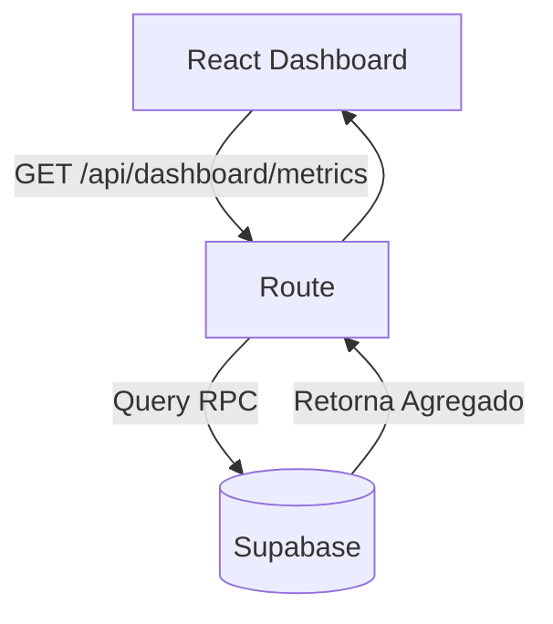

# Spec: [Nome da Dashboard ou Relatório]

> [!NOTE]
> **Como usar este Template:** Utilize o `dashboard-template.md` quando for estruturar novas visualizações de KPIs, relatórios pesados e gráficos analíticos no Frontend (com suas respectivas consultas otimizadas no Backend).
> **Exemplo Preenchido:** `Dashboard do Usuário - Health Score`

## 1. Metadados
| Propriedade | Detalhe |
|---|---|
| **Título** | Dashboard de Analytics do Curador |
| **Autor** | [Seu Nome] |
| **Data de Criação** | DD/MM/AAAA |
| **Status** | `Draft` |
| **Versão** | 1.0.0 |
| **Responsável** | Frontend Squad |
| **Última Atualização** | DD/MM/AAAA |

## 2. Objetivo
Mostrar ao cliente quantas visualizações totais, cliques e geração de receita seus criativos e posts de Telegram alcançaram.

## 3. Contexto
Criar e postar às cegas é ruim. Sem _Feedback Loop_ numérico, o usuário churn. A Dashboard prova o valor da plataforma.

## 4. Requisitos Funcionais
- **RF01:** Exibir 3 cartões superiores principais (Visitas, Receita Estimada, Posts Realizados).
- **RF02:** Gráfico temporal Line Chart (Últimos 7 ou 30 dias).
- **RF03:** Botão para exportar dados para CSV.

## 5. Requisitos Não Funcionais
- **Performance:** Evitar chamadas consecutivas para relatórios pesados. Centralizar e agregar dados no BD antes.

## 6. Arquitetura

## 7. Banco de Dados
- **Novas Views/RPC:** Criação de uma função (Remote Procedure Call) no Supabase `get_user_aggregated_metrics()` que realize `SUM()` e `COUNT()` eficientemente. (Dashboards em tempo real direto da tabela podem ficar lentas).

## 8. Backend
- Rota `GET /api/dashboard/metrics?period=7d`
- Zod limitando os dias para (7, 30, 90) para impedir queries gigantes e ataques DoS na API.

## 9. Frontend
- Implementar biblioteca de gráficos (Recharts ou Chart.js).
- Componentes de layout: `MetricCard`, `TimelineGraph`.
- Skeletons independentes, para que a tela não demore 3 segundos num loading branco antes de montar.

## 10. Integrações
- N/A

## 11. Segurança
- Garantir que a RPC do Banco obedeça estritamente ao RLS do usuário da sessão, somando apenas os criativos e campanhas que ele é dono.

## 12. Performance
- O Banco fará Materialized Views caso as métricas demorem > 2 segundos para retornar.

## 13. Observabilidade
- Rastrear tempo da query da Dashboard.

## 14. Fallbacks
- Se falhar buscar, exibir estado: "Erro ao buscar métricas, os robôs devem estar cansados."

## 15. Critérios de Aceite
- [ ] O Gráfico carrega e os números batem com a tabela.
- [ ] Export para CSV funciona e limpa o payload.

## 16. Plano de Testes
- Tentar inserir 1 milhão de registros mockados local e testar a view para garantir sub-500ms response time.

## 17. Plano de Rollback
- Reverter a view/RPC e o componente.

## 18. Impacto
- Pesado no uso de cache/banco dependendo do acesso constante à home.

## 19. Roadmap
- Relatórios enviados automaticamente por e-mail semanalmente.
