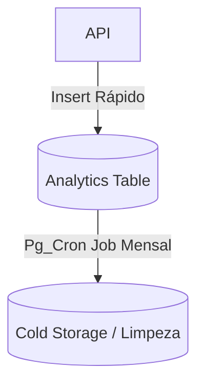

# Spec: [Nome da Tabela ou Alteração de Banco]

> [!NOTE]
> **Como usar este Template:** Utilize o `database-template.md` focado estritamente na parte da infraestrutura de DB quando os dados não pertencerem a uma migração pequena ou trivial, mas sim a um sistema analítico ou core.
> **Exemplo Preenchido:** `Tabela de Telemetria Analytics`

## 1. Metadados
| Propriedade | Detalhe |
|---|---|
| **Título** | Tabela de Analytics de Eventos |
| **Autor** | [Seu Nome] |
| **Data de Criação** | DD/MM/AAAA |
| **Status** | `Draft` |
| **Versão** | 1.0.0 |
| **Responsável** | DB Architect |
| **Última Atualização** | DD/MM/AAAA |

## 2. Objetivo
Estabelecer um local central para injetar logs brutos (Timeseries Data) do sistema de forma rápida sem degradar as tabelas relacionais primárias de usuários.

## 3. Contexto
No momento, misturamos status operacionais na própria tabela de `creatives`, mas precisamos rastrear visualizações, cliques e _Drop-offs_ de funil, sem poluir a tabela de criativos com centenas de linhas filhas.

## 4. Requisitos Funcionais
- **RF01:** Suportar ingestão de 1000+ linhas/s de forma imutável (Append-only).
- **RF02:** Manter o payload flexível via coluna `JSONB`.

## 5. Requisitos Não Funcionais
- **Performance:** Gravação pesada de insert sem constraints limitantes (No Foreign Keys complexas).
- **Gerenciamento de Disco:** Limpeza automática de dados mais antigos que 90 dias (Time-To-Live via Pg_Cron).

## 6. Arquitetura

## 7. Banco de Dados
- **Tabelas:** `analytics_events`.
- **Campos Importantes:** `timestamp` (Indexed), `event_name` (Text), `actor_id` (UUID - Nullable), `properties` (JSONB).
- **RLS:** Permitido INSERTS anônimos caso seja log deslogado, mas SELECT apenas para Admins.

## 8. Backend
- Criação de `AnalyticsRepository`.

## 9. Frontend
- N/A

## 10. Integrações
- N/A

## 11. Segurança
- Como o insert é permissivo, garantir limite de tamanho na string do payload para não saturar o BD com DUMP injetado.

## 12. Performance
- Utilizar Indexação `GIN` sobre a coluna JSONB para permitir _Full-text searches_ nas propriedades de `metadata`.

## 13. Observabilidade
- N/A.

## 14. Fallbacks
- N/A.

## 15. Critérios de Aceite
- [ ] Tabela criada.
- [ ] GIN Index ativo.
- [ ] RLS blindando leituras não autorizadas.

## 16. Plano de Testes
- Tentar injetar string de 10MB para atestar falha do PostgreSQL em rejeitar payload massivo se necessário.

## 17. Plano de Rollback
- Script SQL para fazer o DROP.

## 18. Impacto
- Aloca muito mais espaço de disco no cluster, planejar upgrade de infra do Supabase.

## 19. Roadmap
- Evoluir com partições (Table Partitioning) por ano ou mês.
