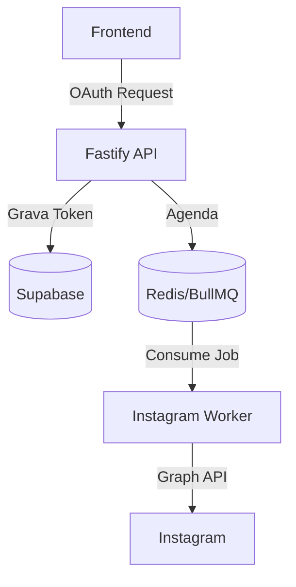

# Spec: [Nome da Feature]

> [!NOTE]
> **Como usar este Template:** Utilize o `feature-template.md` quando for iniciar o desenho de uma nova funcionalidade completa (Epic) que tangencia múltiplas camadas (Frontend, Backend, BD). 
> **Exemplo Preenchido:** Integração com Auto-post do Instagram.

## 1. Metadados
| Propriedade | Detalhe |
|---|---|
| **Título** | Integração Auto-post Instagram |
| **Autor** | [Seu Nome / Agente] |
| **Data de Criação** | DD/MM/AAAA |
| **Status** | `Draft` (Draft / In Review / Approved / Implemented) |
| **Versão** | 1.0.0 |
| **Responsável** | [Tech Lead / Squad] |
| **Última Atualização** | DD/MM/AAAA |

## 2. Objetivo
Permitir que o usuário final conecte sua conta do Instagram Business e habilite o agendamento de posts gerados pelo Creative Studio diretamente para o Feed/Reels.

## 3. Contexto
Atualmente, distribuímos apenas via Telegram e WhatsApp. Os criadores de conteúdo perdem muito tempo baixando o vídeo e publicando manualmente. A automação retém o usuário na nossa plataforma.

## 4. Requisitos Funcionais
- **RF01:** O usuário deve conseguir realizar o OAuth com o Facebook/Instagram.
- **RF02:** O painel deve listar as páginas conectadas.
- **RF03:** Ao agendar um `Creative`, deve ser possível selecionar o destino "Instagram".

## 5. Requisitos Não Funcionais
- **Performance:** O webhook do Instagram deve responder em menos de 200ms.
- **Segurança:** O Access Token de longo prazo deve ser encriptado no Supabase.
- **Resiliência:** Em caso de falha da API da Meta, o Job no BullMQ deve efetuar _Retry_.
- **Observabilidade:** O disparo do post emite logs obrigatórios.

## 6. Arquitetura

## 7. Banco de Dados
- **Novas tabelas:** `social_accounts` (id, user_id, provider, access_token, created_at).
- **Migrações:** Uma migration para adicionar a tabela.
- **Índices:** B-Tree em `user_id`.
- **RLS:** Apenas o dono pode ler/atualizar seu token.
- **Triggers:** N/A.

## 8. Backend
- **Rotas:** `POST /api/social/auth`, `GET /api/social/accounts`.
- **Services:** `SocialIntegrationService.ts`.
- **Repositories:** `SocialAccountRepository.ts`.
- **Workers:** `instagram-sender.worker.ts`.
- **Validators:** Zod no payload do agendamento (obrigar media_url válida).
- **Feature Flags:** `ff_instagram_integration`.
- **Telemetria e Eventos:** Emitir `SocialAccountConnectedEvent` e `InstagramPostSentEvent`.

## 9. Frontend
- **Páginas:** Nova aba em `/dashboard/settings` -> Contas Sociais.
- **Componentes:** `SocialConnectButton.tsx`.
- **Estados/Loading:** Skeleton durante o handshake OAuth.
- **Error States:** Toast vermelho de erro "Sessão Expirada".

## 10. Integrações
- **APIs Externas:** Meta Graph API (v19.0).
- **BullMQ:** Adição da fila `instagram-publish`.

## 11. Segurança
- **Autorização:** Validar JWT Bearer para acesso à rota.
- **Sanitização:** Limpar tokens vazados nos logs do Fastify.
- **Rate Limit:** Restringir tentativas de autenticação falhas.
- **Auditoria:** Gravar no `audit_logs` quando uma conta for vinculada.

## 12. Performance
- **Cache:** Fazer cache do ID da página no Redis (TTL 1h) para não consultar a Meta a cada post.
- **Fila:** Limitar concorrência do `instagram-sender` em 5.

## 13. Observabilidade
- **Correlation ID:** Repassar o UUID do Post agendado até a Meta API e salvar o ID do Post retornado.
- **Health Score:** Se > 10% dos envios falharem na última hora, disparar alerta no Slack do SRE.

## 14. Fallbacks
- Se a API da Meta responder com 429 (Too Many Requests), acionar Backoff Exponencial no Worker.
- Se o token expirar, marcar `status = disconnected` no BD e notificar o usuário via UI (Toast/Email).

## 15. Critérios de Aceite
- [ ] O usuário conecta a conta com sucesso.
- [ ] O token é gravado via RLS seguro.
- [ ] O envio do vídeo é postado no Reels real.
- [ ] O Audit Log registra a ação.

## 16. Plano de Testes
- **Unitários:** Mockar a Meta Graph API no `SocialIntegrationService.test.ts`.
- **E2E:** Validar fluxo OAuth via Cypress.

## 17. Plano de Rollback
- Desabilitar a `Feature Flag` `ff_instagram_integration` no painel. O botão sumirá para os clientes. 
- A migration pode ser revertida com `DROP TABLE social_accounts;`.

## 18. Impacto
- **Banco:** Baixo.
- **Usuário:** Alto (Nova fonte de tráfego orgânico).

## 19. Roadmap
- Futuro: Habilitar resposta automática a comentários no post utilizando o Marketing Brain.
