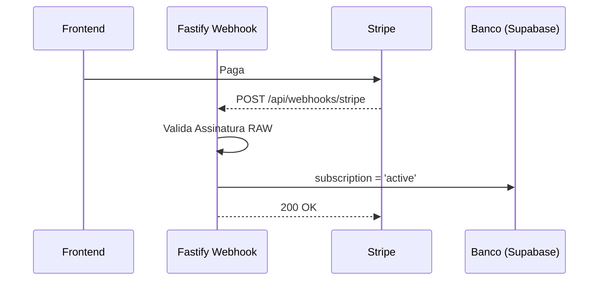

# Spec: [Nome da Integração ou Provider]

> [!NOTE]
> **Como usar este Template:** Utilize o `integration-template.md` quando o sistema tiver de sair da própria nuvem para orquestrar serviços de terceiros (Gateways de Pagamento, OpenAI, APIs oficiais de Marketplaces, etc).
> **Exemplo Preenchido:** `Integração Stripe Billing`

## 1. Metadados
| Propriedade | Detalhe |
|---|---|
| **Título** | Integração Stripe Billing (Assinaturas) |
| **Autor** | [Seu Nome] |
| **Data de Criação** | DD/MM/AAAA |
| **Status** | `Draft` |
| **Versão** | 1.0.0 |
| **Responsável** | Billing Squad |
| **Última Atualização** | DD/MM/AAAA |

## 2. Objetivo
Lidar com o faturamento, renovação, cancelamento e Webhooks atrelados à assinatura de planos da plataforma Achadinhos em Minutos via Stripe.

## 3. Contexto
A plataforma agora é um SaaS pago. O Feature Flags apenas limitam, precisamos de algo que cobre e desbloqueie o cliente no banco.

## 4. Requisitos Funcionais
- **RF01:** Disparar Checkout Session do Stripe redirecionando o cliente.
- **RF02:** Escutar o Webhook do Stripe: `checkout.session.completed` e liberar o plano no banco.
- **RF03:** Escutar o Webhook do Stripe: `customer.subscription.deleted` e bloquear o plano.

## 5. Requisitos Não Funcionais
- **Segurança:** O Endpoint de Webhook tem que validar estritamente o Sig (Signature) recebido via raw-body (Evitar Bypass de pagamento fingido).

## 6. Arquitetura

## 7. Banco de Dados
- Mapeamento: Tabela `billing_subscriptions` (user_id, stripe_customer_id, status, plan_id, end_date).

## 8. Backend
- Habilitar middleware customizado no Fastify para **NÃO** parsear JSON nativamente na rota de Webhook, deixando como _Buffer_ para a verificação criptográfica do Signature da Stripe.

## 9. Frontend
- Modal bloqueando geração de vídeo para quem `status !== 'active'`.

## 10. Integrações
- SDK oficial do Stripe Node v14+.

## 11. Segurança
- Proteção máxima de Secret Keys injetadas estritamente via Variáveis de Ambiente (.env) e nunca comitadas no GitHub.

## 12. Performance
- O Webhook tem que responder 200 OK de forma muito rápida, senão o Stripe realiza _Retry_ do webhook, causando assinaturas duplicadas se não for idempotente.

## 13. Observabilidade
- Emissão do evento `SubscriptionActivatedEvent` para Telemetria financeira.

## 14. Fallbacks
- Se o DB estiver offline na hora do Webhook, retornar HTTP 500 proposital, forçando a Stripe a re-tentar o envio nas próximas horas.

## 15. Critérios de Aceite
- [ ] Compra do plano teste libera os limites.
- [ ] Tentativa falsa de Webhook com Sig inválida devolve 400.

## 16. Plano de Testes
- Utilizar `stripe-cli` para encaminhar webhooks reais no localhost durante testes.

## 17. Plano de Rollback
- Revogar a permissão geral (dar premium para todo mundo de graça) enquanto conserta, revertendo o PR.

## 18. Impacto
- Monetário direto.

## 19. Roadmap
- Evoluir com Upsells (Pay per usage).
