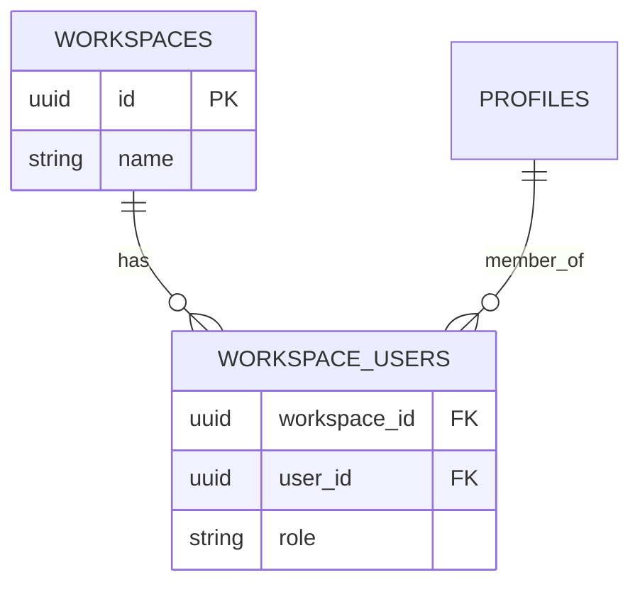

# Spec: [Nome da Migration]

> [!NOTE]
> **Como usar este Template:** Utilize o `migration-template.md` antes de gerar uma nova alteração de banco de dados e aplicar o `supabase migration new`.
> **Exemplo Preenchido:** `20260701000000_add_teams.sql`

## 1. Metadados
| Propriedade | Detalhe |
|---|---|
| **Título** | Criação da tabela de Workspaces (Teams) |
| **Autor** | [Seu Nome] |
| **Data de Criação** | DD/MM/AAAA |
| **Status** | `Draft` |
| **Versão** | 1.0.0 |
| **Responsável** | DB Architect |
| **Última Atualização** | DD/MM/AAAA |

## 2. Objetivo
Criar uma estrutura relacional para permitir que múltiplos usuários pertençam ao mesmo time (Workspace) e compartilhem a mesma franquia de créditos (Billing).

## 3. Contexto
A plataforma inicialmente era Single-User. Agências solicitaram compartilhamento do ambiente para múltiplos curadores de ofertas.

## 4. Requisitos Funcionais
- **RF01:** Tabela `workspaces` contendo ID e Nome.
- **RF02:** Tabela pivô `workspace_users` com Enum de Roles (Admin, Member).

## 5. Requisitos Não Funcionais
- **Segurança:** Apenas usuários que estão em `workspace_users` podem ler as campanhas associadas àquele workspace.
- **Integração Relacional:** Apagar um Workspace deve fazer _Cascade Delete_ nas permissões pivôs, mas _Restrict_ se houverem faturas abertas.

## 6. Arquitetura


## 7. Banco de Dados
- **Novas tabelas:** `workspaces`, `workspace_users`.
- **Migrações:** `20260701000000_add_workspaces_v2.sql`.
- **Índices:** `user_id` em `workspace_users`.
- **RLS:** `SELECT ON workspaces USING (EXISTS (SELECT 1 FROM workspace_users WHERE user_id = auth.uid() AND workspace_id = workspaces.id))`
- **Triggers:** Um trigger pós inserção em `profiles` para criar um Workspace pessoal automático.

## 8. Backend
- Modificar queries nos Repositórios para passarem o contexto do Workspace ID ao invés de apenas `user_id`.

## 9. Frontend
- N/A para esta spec puramente de infraestrutura (ver Feature Spec).

## 10. Integrações
- N/A

## 11. Segurança
- Muito cuidado para o RLS de `workspace_users` não criar um _Infinite Recursion Loop_ no Supabase.

## 12. Performance
- O RLS com `EXISTS` acarreta custo de scan. Os índices propostos em `user_id` são obrigatórios para mitigar.

## 13. Observabilidade
- N/A.

## 14. Fallbacks
- N/A.

## 15. Critérios de Aceite
- [ ] Tabela criada.
- [ ] RLS impede usurpação de workspace de terceiro.
- [ ] Typings automáticos do Supabase geram o arquivo TypeScript correspondente após o reset.

## 16. Plano de Testes
- Tentar inserir manualmente dados na tabela via REST api injetando um JWT de um usuário não-membro e aguardar erro 401/403 (RLS Violation).

## 17. Plano de Rollback
- Código SQL exato do rollback:
```sql
DROP TABLE workspace_users;
DROP TABLE workspaces;
```

## 18. Impacto
- **Banco:** Alto, mudança transversal. Exige parada planejada (Zero-downtime migration é difícil aqui).

## 19. Roadmap
- Relacionar as permissões a uma nova tabela de faturamento (Stripe) no futuro.
