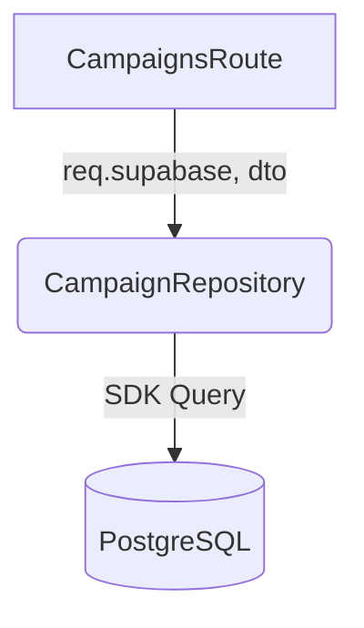

# Spec: [Nome do Repository]

> [!NOTE]
> **Como usar este Template:** Utilize o `repository-template.md` quando a arquitetura necessitar de um novo mapeamento CRUD para uma entidade ou agregação específica.
> **Exemplo Preenchido:** `CampaignRepository`

## 1. Metadados
| Propriedade | Detalhe |
|---|---|
| **Título** | Repositório de Campanhas de Disparo |
| **Autor** | [Seu Nome] |
| **Data de Criação** | DD/MM/AAAA |
| **Status** | `Draft` |
| **Versão** | 1.0.0 |
| **Responsável** | Backend Squad |
| **Última Atualização** | DD/MM/AAAA |

## 2. Objetivo
Centralizar todos os comandos DML (Select, Insert, Update) para a entidade de Campanhas, garantindo que as regras RLS não sejam burladas.

## 3. Contexto
Estávamos injetando `supabase.from('campaigns')` diretamente nos Controllers, dificultando testes e mocks.

## 4. Requisitos Funcionais
- **RF01:** Método `getCampaignsByUser(userId: string)`.
- **RF02:** Método `createCampaign(data, userId)`.
- **RF03:** Método restrito `updateCampaignStatus` (Para uso de Worker, aceitando adminClient).

## 5. Requisitos Não Funcionais
- **Segurança:** Propagar sempre a instância do `req.supabase` ligada ao Token do usuário em chamadas vindas de requisição HTTP.

## 6. Arquitetura

## 7. Banco de Dados
- **Tabelas Manipuladas:** `campaigns`
- **Índices Requeridos:** `user_id` e `status` para buscas mais rápidas.

## 8. Backend
- Não engloba regras complexas de validação. Apenas traduz DTO para colunas SQL.

## 9. Frontend
- N/A

## 10. Integrações
- `@supabase/supabase-js`.

## 11. Segurança
- O Repositório confia cegamente no RLS. O método `getById(id)` não precisa filtrar `WHERE user_id = x` manualmente se o `supabase client` passado foi inicializado com o JWT. Se foi feito via service key (admin), a restrição é de responsabilidade do chamador.

## 12. Performance
- Utilizar `.select('id, name').limit(100)` para paginação. Nunca `.select('*')` em massa se não for exigido.

## 13. Observabilidade
- N/A.

## 14. Fallbacks
- Lançar erro formatado via custom AppError que a Rota consiga interpretar como `500`.

## 15. Critérios de Aceite
- [ ] O repositório lida corretamente com o erro de "Violates Row Level Security".
- [ ] Os tipos de retorno estão alinhados aos gerados pelo TypeScript no Supabase local (ex: `Tables<'campaigns'>`).

## 16. Plano de Testes
- Mocks estritos no jest do cliente do Supabase.

## 17. Plano de Rollback
- N/A. Arquivo novo, bastaria remover chamadas na Rota.

## 18. Impacto
- Menor acoplamento.

## 19. Roadmap
- Evoluir com um cache redis temporário nas respostas repetitivas.
