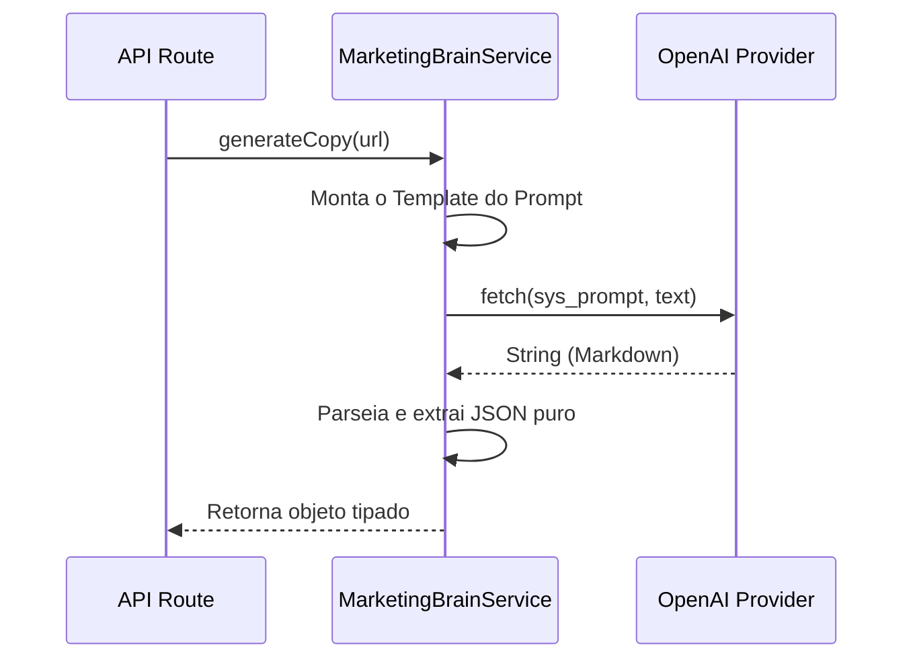

# Spec: [Nome do Service]

> [!NOTE]
> **Como usar este Template:** Utilize o `service-template.md` quando a arquitetura necessitar de uma nova classe ou singleton focado em domínio (Regras de negócio que isolam o Router e o BD).
> **Exemplo Preenchido:** `MarketingBrainService`

## 1. Metadados
| Propriedade | Detalhe |
|---|---|
| **Título** | Inteligência de Geração de Copys |
| **Autor** | [Seu Nome] |
| **Data de Criação** | DD/MM/AAAA |
| **Status** | `Approved` |
| **Versão** | 1.0.0 |
| **Responsável** | AI Squad |
| **Última Atualização** | DD/MM/AAAA |

## 2. Objetivo
Abstrair a chamada direta aos provedores (OpenAI/Anthropic) embutindo regras sintáticas da persona do aplicativo para gerar o "Roteiro" do vídeo viral.

## 3. Contexto
As requisições estavam muito misturadas na rota Fastify e sem um controle central do Prompt mestre. É necessário uma classe focada em enriquecer o prompt e estruturar a saída em JSON.

## 4. Requisitos Funcionais
- **RF01:** Expor método `generateCopy(productUrl, metadata)`.
- **RF02:** Retornar o formato estrito JSON `CreativeDNA`.
- **RF03:** Injetar o persona system prompt.

## 5. Requisitos Não Funcionais
- **Performance:** Prompts rápidos com _temperature_ ideal (0.7).
- **Resiliência:** Se a API da OpenAI engasgar, o Service deve possuir timeout lógico.

## 6. Arquitetura

## 7. Banco de Dados
- **Modificações:** Nenhuma. Services usam repositórios.
- **Acesso:** N/A. (Delega a gravação do log ao repositório apropriado, se necessário).

## 8. Backend
- **Dependências:** `AIProviderClient` injetado na classe.
- **Telemetria e Eventos:** Emitir evento local `CreativeGenerationStartedEvent`.

## 9. Frontend
- N/A.

## 10. Integrações
- SDK nativo do provedor alvo (ou API Rest genérica).

## 11. Segurança
- O Service nunca deve imprimir em logs chaves vazadas de clientes ou Access Tokens que passarem pelos parâmetros.

## 12. Performance
- **Timeout da regra:** Interromper a chamada (AbortController) se demorar mais que 15 segundos.

## 13. Observabilidade
- **Eventos:** Gravar tempo exato que o LLM demorou e tamanho de tokens gastos.

## 14. Fallbacks
- Se OpenAI falhar por quota excedida, o Service deve silenciar o erro e repassar o Prompt idêntico para a Anthropic/Claude automaticamente.

## 15. Critérios de Aceite
- [ ] O Service garante que a saída nunca será texto quebrado, lançando exceção se o parser JSON do texto do LLM falhar.
- [ ] Instancia como singleton `export const marketingBrain = new MarketingBrainService();`.

## 16. Plano de Testes
- **Unitários:** Passar um Dummy LLM Provider injetado e garantir que o Service consegue fatiar as variáveis do JSON (Mock tests).

## 17. Plano de Rollback
- Voltar a importação nas rotas para a versão V1 do Service (Mantendo a interface compatível).

## 18. Impacto
- Altera drasticamente a qualidade gerada pela inteligência. Avaliar conversões.

## 19. Roadmap
- Evolução do Service para suportar "Few-Shot Prompts" via banco de vetores.
