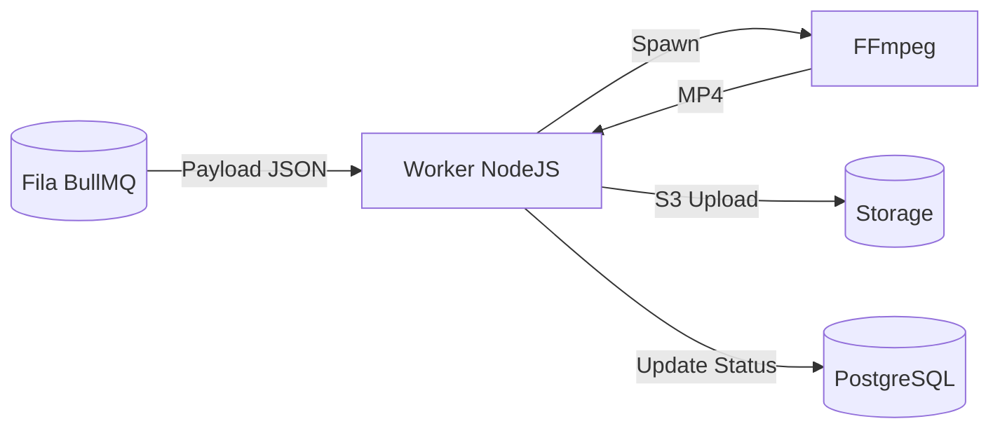

# Spec: [Nome do Worker / Processo de Fila]

> [!NOTE]
> **Como usar este Template:** Utilize o `worker-template.md` quando a feature exigir uma nova fila (Queue) no BullMQ e a configuração de um script autônomo.
> **Exemplo Preenchido:** `Video Render Worker`

## 1. Metadados
| Propriedade | Detalhe |
|---|---|
| **Título** | Vídeo Renderização via FFmpeg |
| **Autor** | [Seu Nome] |
| **Data de Criação** | DD/MM/AAAA |
| **Status** | `Draft` |
| **Versão** | 1.0.0 |
| **Responsável** | SRE Squad |
| **Última Atualização** | DD/MM/AAAA |

## 2. Objetivo
Processar de forma isolada os JSONs (Storyboards) do Marketing Brain e gerar os bytes puros de um vídeo MP4 utilizando os assets em nuvem.

## 3. Contexto
Renderizar mídia é uma tarefa intensiva em CPU. Fazer isso bloqueando a thread HTTP do Fastify derrubaria o servidor.

## 4. Requisitos Funcionais
- **RF01:** O worker deve consumir a fila `creative-render`.
- **RF02:** Baixar temporariamente as imagens do URL fornecido.
- **RF03:** Transcodificar e aplicar o texto com sombra e fonte.

## 5. Requisitos Não Funcionais
- **Performance:** CPU-Bound. Deve utilizar sub-processos limitados.
- **Resiliência:** Tentativas máximas por vídeo = 2.
- **Escalabilidade:** Deve rodar isolado num dyno/container que possa ser replicado horizontalmente.

## 6. Arquitetura

## 7. Banco de Dados
- **Modificações:** Atualizar as linhas da tabela `creatives` para `status = ready`.
- **Acesso:** Realizado via `supabaseAdmin` em background (bypassa RLS).

## 8. Backend
- **Queues:** Nova fila registrada no construtor padrão.
- **Services:** N/A (Worker tem regra autônoma).
- **Telemetria:** `FFmpegTime` (Duração em segundos da renderização).

## 9. Frontend
- N/A.

## 10. Integrações
- Binário do `ffmpeg` no contêiner.

## 11. Segurança
- Trabalhar sobre `/tmp/` para armazenamento efêmero e apagar os arquivos logo ao final da renderização (Prevenção contra esgotamento de disco).

## 12. Performance
- Concorrência travada rigidamente em `2` por CPU Core.

## 13. Observabilidade
- Se o Exit Code do FFmpeg não for 0, cuspir os _stderr_ inteiros no Logger e marcar job como Failed.

## 14. Fallbacks
- N/A. Se falhar, notifica erro ao BD para avisar ao usuário.

## 15. Critérios de Aceite
- [ ] O Job inicia e bloqueia no BullMQ.
- [ ] O banco é atualizado para "pending".
- [ ] O vídeo gerado pesa menos de 10MB para 15 segundos.
- [ ] O banco atualiza para "ready".
- [ ] Pasta /tmp/ fica vazia no final.

## 16. Plano de Testes
- Testar falha injetando uma URL de imagem 404 quebrada no JSON, certificando-se de que o worker lida graciosamente e não "capota" (crash loop).

## 17. Plano de Rollback
- Parar a fila (Pause) pelo Redis Insight.

## 18. Impacto
- Elevado risco de custo financeiro e saturação de processamento se for loop infinito. Monitorar RAM.

## 19. Roadmap
- Evoluir para GPU-bound rendering na nuvem externa futuramente.
